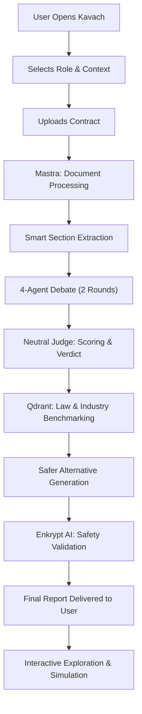
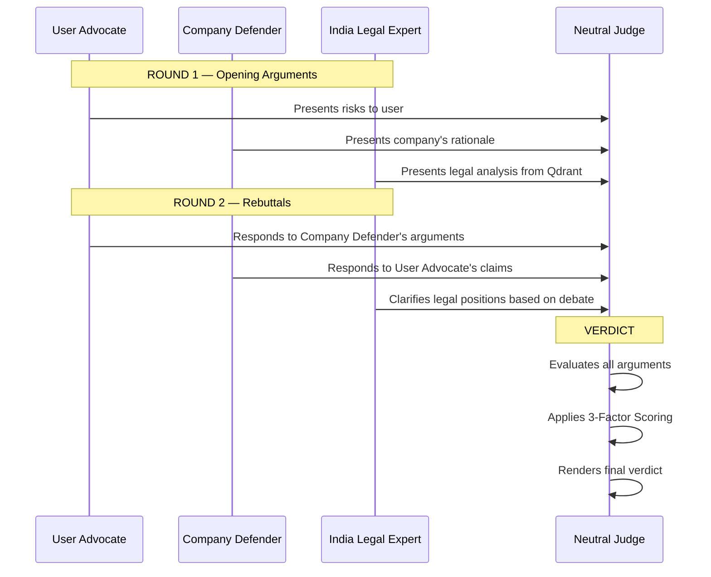
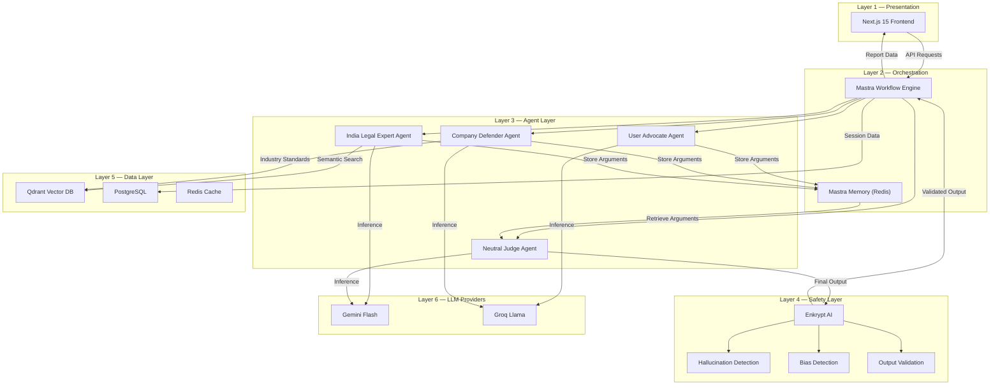

# KAVACH — Project Synopsis

> **Your AI Legal Shield — Analyze. Debate. Protect.**

**Submitted for:** India's First AI Agent Hackathon  
**Date:** June 2026  
**Mandatory Stack:** Mastra · Qdrant · Enkrypt AI

---

## Table of Contents

1. [Project Title & Tagline](#1-project-title--tagline)
2. [Problem Statement](#2-problem-statement)
3. [Solution Overview](#3-solution-overview)
4. [Key Objectives](#4-key-objectives)
5. [Target Users](#5-target-users)
6. [Core Features](#6-core-features)
7. [How Kavach Works — End-to-End Workflow](#7-how-kavach-works--end-to-end-workflow)
8. [Multi-Agent Debate System](#8-multi-agent-debate-system)
9. [Scoring System](#9-scoring-system)
10. [Benchmarking Against Standard Practices](#10-benchmarking-against-standard-practices)
11. [Generation of Safer Alternatives](#11-generation-of-safer-alternatives)
12. [Technology Stack](#12-technology-stack)
13. [Architecture Overview](#13-architecture-overview)
14. [How Enkrypt AI is Used for Safety](#14-how-enkrypt-ai-is-used-for-safety)
15. [Unique Value Proposition](#15-unique-value-proposition)

---

## 1. Project Title & Tagline

| Field | Details |
|---|---|
| **Project Name** | **Kavach** (कवच — *meaning "shield" or "armor" in Hindi*) |
| **Tagline** | *Your AI Legal Shield — Analyze. Debate. Protect.* |

**One-Line Description:**  
Kavach is a production-grade AI Legal Agent that empowers everyday individuals — job seekers, freelancers, and consumers — to understand contracts, surface hidden risks through multi-perspective debate, benchmark clauses against Indian law and industry standards, and receive actionable safer alternatives, all powered by **Mastra**, **Qdrant**, and **Enkrypt AI**.

---

## 2. Problem Statement

### The Reality of Contract Signing in India

Every day, millions of Indians sign contracts they do not fully understand. A fresh graduate accepting their first offer letter, a freelance designer agreeing to a client's service agreement, or a consumer clicking "I Agree" on a subscription — each of these individuals enters into legally binding obligations without the knowledge, time, or resources to evaluate what they are consenting to.

### The Core Problems

| Problem | Impact |
|---|---|
| **Legal illiteracy** | Over 80% of first-time job seekers in India sign offer letters without reading them in full. Hidden clauses around non-compete, IP assignment, and termination can silently restrict their future career options. |
| **Power asymmetry** | Contracts are drafted by the company's legal team to maximize the company's protection. The individual on the other side has no legal team, no negotiation leverage, and often no awareness that certain clauses are unusual or unfair. |
| **Cost of legal advice** | Professional legal review of a single contract in India ranges from ₹5,000 to ₹25,000+. This is prohibitively expensive for students, freshers, and freelancers — the very people who need it most. |
| **Inaccessible language** | Legal documents are written in dense, jargon-heavy language specifically designed to be precise for lawyers, not comprehensible for laypeople. |
| **No benchmark awareness** | Even if a user suspects a clause is unfair, they have no way to know what is "standard" in their industry or what Indian law actually says about it. |

### What Existing Tools Fail to Address

Current AI-based legal tools suffer from critical shortcomings:

- **Surface-level summarization** — They paraphrase the contract but do not identify *why* a clause is risky or *how* it compares to legal standards.
- **Enterprise-first design** — Most contract analysis tools (Ironclad, Juro, DocuSign Insight) are built for corporate legal teams, not for the individual signing the contract.
- **No Indian legal grounding** — Global tools have no knowledge of the Indian Contract Act (1872), IT Act (2000), state-specific labor regulations, or Indian judicial precedents.
- **No adversarial reasoning** — A single-agent summary cannot replicate the depth of analysis that emerges when multiple perspectives challenge each other.
- **No safety guarantees** — LLMs hallucinate legal citations. Without a dedicated safety layer, users may act on fabricated laws or non-existent court rulings.

> [!IMPORTANT]
> Kavach exists because no tool today gives a normal Indian individual the ability to understand their contract from multiple angles, grounded in real Indian law, with provably safe outputs.

---

## 3. Solution Overview

Kavach is an **AI-powered legal agent** that transforms contract analysis from a passive summary into an active, multi-perspective investigation. It is designed around three foundational principles:

1. **Debate, Don't Summarize** — Instead of a single AI opinion, Kavach deploys four specialized agents that argue for and against each clause, grounded in Indian law.
2. **Ground in Reality** — Every legal reference and industry benchmark is retrieved from a curated **Qdrant** vector database, not generated from the model's training data.
3. **Guarantee Safety** — Every output passes through **Enkrypt AI** to detect hallucinated citations, biased reasoning, and misleading conclusions before reaching the user.

### What Kavach Delivers

For every contract uploaded, the user receives:

- A **clause-by-clause risk analysis** with severity scores
- A **multi-agent debate transcript** showing arguments from the user's side, the company's side, and Indian law
- A **final judicial verdict** from a neutral judge agent
- **Benchmarking data** comparing each clause to Indian law and industry norms
- **Safer alternative clauses** ready to propose during negotiation
- **Plain-language explanations** that any non-lawyer can understand
- **Ready-to-send negotiation messages** the user can copy and use directly

---

## 4. Key Objectives

| # | Objective | Description |
|---|---|---|
| 1 | **Democratize Legal Understanding** | Make contract analysis accessible to anyone, regardless of legal knowledge or financial resources. |
| 2 | **Enable Multi-Perspective Risk Assessment** | Move beyond single-agent summarization to a structured debate that surfaces risks a single perspective would miss. |
| 3 | **Ground Analysis in Indian Law** | Ensure every legal claim is backed by retrievable Indian statutes, regulations, and industry standards stored in Qdrant. |
| 4 | **Deliver Actionable Outputs** | Provide not just risk identification, but concrete safer alternatives and ready-to-use negotiation language. |
| 5 | **Guarantee Output Safety** | Eliminate hallucinated legal citations and biased reasoning through systematic Enkrypt AI validation. |
| 6 | **Operate Within the Mandatory Stack** | Build the entire solution on Mastra (orchestration), Qdrant (vector retrieval), and Enkrypt AI (safety). |

---

## 5. Target Users

Kavach is designed exclusively for **individuals** — the people who are typically on the weaker side of a contract negotiation.

| User Segment | Typical Scenario | Key Concerns |
|---|---|---|
| **Job Seekers & Fresh Graduates** | Signing their first offer letter or employment agreement | Non-compete clauses, notice periods, bond/training agreements, IP assignment |
| **Freelancers & Gig Workers** | Accepting service agreements, NDAs, or platform terms | Payment terms, scope creep, liability caps, termination without cause |
| **Consumers** | Agreeing to subscription terms, rental agreements, or loan contracts | Auto-renewal traps, hidden fees, data usage, dispute resolution bias |
| **Small Business Owners** | Signing vendor agreements or partnership contracts | Indemnity clauses, exclusivity terms, payment timelines |
| **Anyone in a Weaker Negotiating Position** | Any individual facing a contract drafted by the other party's legal team | Understanding what is standard vs. what is unusual or unfair |

> [!NOTE]
> Kavach is **not** a tool for lawyers or corporate legal departments. It is purpose-built for the person *across the table* from those teams.

---

## 6. Core Features

### 6.1 Intelligent Contract Parsing

Kavach accepts contracts in **PDF**, **DOCX**, or **plain text** format. Using Gemini Flash via Mastra tool calling, the system extracts and structures the document into semantically meaningful sections — Payment Terms, Termination, Non-Compete, IP Rights, Liability, Confidentiality, Dispute Resolution, and more. Irrelevant boilerplate (e.g., formatting preambles, signature blocks) is filtered out to focus agent analysis on substantive clauses.

### 6.2 Multi-Agent Debate Analysis

The core intelligence of Kavach. Four specialized agents — User Advocate, Company Defender, India Legal Expert, and Neutral Judge — engage in a structured 2-round debate over each extracted clause. This is not a single LLM generating a summary; it is a genuine adversarial process where agents challenge and respond to each other's arguments through Mastra's memory-based message passing.

### 6.3 3-Factor Weighted Risk Scoring

Every clause receives a transparent risk score (0–100) computed from three independently assessed factors: Harm Potential, Legal Strength, and Practical Likelihood. The formula, weights, and rubrics are fully disclosed to the user, ensuring the score is explainable and auditable.

### 6.4 Indian Law Benchmarking

Kavach retrieves relevant sections of Indian statutes (Indian Contract Act 1872, Information Technology Act 2000, state labor laws, consumer protection regulations) from **Qdrant** and compares the contract clause against them. The user sees exactly which law applies and whether the clause is compliant, ambiguous, or potentially unenforceable.

### 6.5 Industry Standard Benchmarking

Beyond legal compliance, Kavach compares clauses against curated industry norms stored in Qdrant. For example, it can tell a user that a 2-year non-compete is significantly stricter than the 6–12 month standard in the Indian IT sector.

### 6.6 Safer Alternative Generation

For every clause identified as medium-to-high risk, Kavach automatically generates 1–2 rewritten versions that better protect the user's interests while remaining commercially reasonable. These alternatives are not aspirational rewrites — they are grounded in what courts have historically found enforceable.

### 6.7 Plain-Language Explanations

Every risk assessment, legal reference, and recommendation is translated into clear, jargon-free language. The user does not need to understand legal terminology to act on Kavach's findings.

### 6.8 Negotiation Support

Kavach generates ready-to-copy email or message templates that the user can send to the other party to propose changes. These messages are professionally worded and reference the specific concerns identified during analysis.

### 6.9 Interactive Clause Simulator

The user can edit any clause and re-submit it to the debate system to see how the modified version scores. This allows iterative refinement before entering a real negotiation.

### 6.10 Enkrypt AI Safety Guardrails

All outputs are validated through Enkrypt AI before being shown to the user. This includes detection of hallucinated legal citations, identification of bias in agent reasoning, and validation of output structure and consistency.

---

## 7. How Kavach Works — End-to-End Workflow

The following describes the complete journey from the moment a user opens Kavach to the delivery of the final report.



### Step 1 — User Onboarding & Context Setting

When the user opens Kavach, they are asked to select their **role**:
- Job Seeker
- Freelancer
- Consumer
- Custom / Other

They are then presented with 3–5 **optional** contextual questions tailored to their role. For example, a job seeker might be asked about their experience level, industry, and whether they have specific concerns (e.g., non-compete, relocation). These answers are injected into agent prompts to personalize the analysis. Skipping the questions is fully supported — the system defaults to general analysis.

### Step 2 — Document Upload & Processing

The user uploads their contract as a **PDF**, **DOCX**, or pastes raw text. Mastra triggers a document processing tool powered by **Gemini Flash** that:
- Extracts raw text from the uploaded file
- Normalizes formatting inconsistencies
- Converts the document into a clean, structured representation

### Step 3 — Smart Section Extraction

Rather than sending the entire document to the debate agents (which would dilute focus and increase cost), Kavach identifies and extracts only the **substantive clauses** that typically carry legal risk:

| Extracted Section | Why It Matters |
|---|---|
| Compensation & Payment Terms | Delayed payment, vague milestones, penalty clauses |
| Termination Conditions | Termination without cause, inadequate notice periods |
| Non-Compete & Non-Solicitation | Restrictions on future employment or business |
| Intellectual Property Assignment | Overly broad IP transfer, work-for-hire traps |
| Liability & Indemnification | Uncapped liability, one-sided indemnity |
| Confidentiality & NDA | Excessively long confidentiality periods, broad scope |
| Dispute Resolution | Biased arbitration clauses, inconvenient jurisdiction |
| Governing Law | Jurisdiction selection that disadvantages the user |

Each extracted section becomes a **debate topic** processed independently by the agent system.

### Step 4 — Multi-Agent Debate

*Described in full detail in [Section 8](#8-multi-agent-debate-system).*

### Step 5 — Risk Scoring

*Described in full detail in [Section 9](#9-scoring-system).*

### Step 6 — Benchmarking

*Described in full detail in [Section 10](#10-benchmarking-against-standard-practices).*

### Step 7 — Safer Alternative Generation

*Described in full detail in [Section 11](#11-generation-of-safer-alternatives).*

### Step 8 — Enkrypt AI Safety Validation

Before any output is presented to the user, the complete report is passed through **Enkrypt AI** for:
- **Hallucination Detection** — Verifying that all cited legal sections, act names, and precedents correspond to real Indian law
- **Bias Detection** — Ensuring no agent's output is disproportionately influencing the final score without justification
- **Output Validation** — Confirming structural integrity, consistency of scores, and coherence of recommendations

Any flagged output is regenerated or annotated with a confidence disclaimer.

### Step 9 — Final Report Delivery

The user receives a comprehensive report containing:

- **Overall Contract Risk Score** (0–100) with a visual gauge
- **Clause-by-Clause Breakdown**, each including:
  - Risk level (Low / Medium / High / Critical)
  - Plain-language explanation of the risk
  - Debate summary (key arguments from each agent)
  - Benchmarking result (vs. Indian law + industry standards)
  - 1–2 safer alternative clauses
  - Ready-to-send negotiation message
- **Key Findings Summary** highlighting the most critical issues
- **Recommended Actions** prioritized by severity

### Step 10 — Interactive Exploration

After receiving the report, the user can:
- Expand any clause to read the full debate transcript
- Use the **Negotiation Simulator** to test modified clause language
- Download the report as PDF
- Copy negotiation messages directly

---

## 8. Multi-Agent Debate System

The debate system is the intellectual core of Kavach. It replaces single-perspective summarization with structured adversarial reasoning, producing analysis that is deeper, more balanced, and more trustworthy.

### 8.1 The Four Agents

#### Agent 1 — User Advocate 🛡️

| Attribute | Detail |
|---|---|
| **Role** | Zealously represents the user's interests |
| **Perspective** | "How could this clause harm the person signing it?" |
| **Behavior** | Identifies worst-case scenarios, highlights power imbalances, flags clauses that are unusual or one-sided. Tends to interpret ambiguous language against the drafter (applying the *contra proferentem* principle). |
| **Powered By** | Groq Llama (fast inference for debate rounds) |
| **Data Sources** | User context (role, experience, concerns), extracted clause text |

#### Agent 2 — Company Defender ⚖️

| Attribute | Detail |
|---|---|
| **Role** | Presents the company's rationale for including each clause |
| **Perspective** | "Why would a reasonable company include this clause?" |
| **Behavior** | Explains legitimate business reasons for contractual protections. Identifies clauses that are actually standard and fair. Challenges the User Advocate's arguments when they are exaggerated. |
| **Powered By** | Groq Llama |
| **Data Sources** | Industry standard practices (from Qdrant), extracted clause text |

#### Agent 3 — India Legal Expert 📜

| Attribute | Detail |
|---|---|
| **Role** | Provides authoritative analysis grounded in Indian law |
| **Perspective** | "What does Indian law say about this clause?" |
| **Behavior** | Retrieves and cites specific sections of Indian statutes from Qdrant. Assesses enforceability under Indian jurisdiction. References relevant judicial interpretations where applicable. Does not advocate for either party — provides neutral legal analysis. |
| **Powered By** | Gemini Flash (for precise legal reasoning) |
| **Data Sources** | Qdrant vector database (Indian Contract Act 1872, IT Act 2000, labor laws, consumer protection acts, judicial precedents) |

#### Agent 4 — Neutral Judge 🏛️

| Attribute | Detail |
|---|---|
| **Role** | Evaluates the full debate and renders a final verdict |
| **Perspective** | "Given all arguments, how risky is this clause for the user?" |
| **Behavior** | Reads all arguments from Rounds 1 and 2. Weighs the strength of each agent's position. Applies the 3-Factor Scoring Formula. Produces the final risk score, plain-language explanation, and recommendation. |
| **Powered By** | Gemini Flash (for balanced judicial reasoning) |
| **Data Sources** | Complete debate transcript (via Mastra Memory), scoring rubrics |

### 8.2 The 2-Round Debate Process



#### Round 1 — Opening Arguments

Each of the three arguing agents independently analyzes the clause and presents their opening position:

- **User Advocate** highlights every potential risk, worst-case scenario, and power imbalance.
- **Company Defender** explains the business logic behind the clause and identifies which aspects are standard practice.
- **India Legal Expert** queries Qdrant for relevant Indian statutes and provides legal analysis of enforceability and compliance.

All three arguments are stored in **Mastra Memory**, making them accessible to all agents in Round 2.

#### Round 2 — Rebuttals

Each agent reads the other agents' Round 1 arguments (via Mastra Memory message passing) and responds:

- **User Advocate** challenges the Company Defender's justifications and may cite the Legal Expert's findings to strengthen their case.
- **Company Defender** addresses the Advocate's concerns, conceding valid points while defending reasonable protections.
- **India Legal Expert** refines their analysis based on the specific arguments raised, providing more targeted legal references.

#### Verdict

The **Neutral Judge** receives the complete debate transcript (all 6 messages across 2 rounds) and:
1. Evaluates the strength of each argument
2. Identifies points of consensus and disagreement
3. Applies the 3-Factor Weighted Scoring Formula
4. Produces a final risk score, detailed explanation, and recommendation

### 8.3 Why Debate is Superior to Single-Agent Analysis

| Single-Agent Approach | Multi-Agent Debate (Kavach) |
|---|---|
| One perspective, prone to bias | Four perspectives, self-correcting |
| Misses risks that require adversarial thinking | Adversarial structure surfaces hidden risks |
| No accountability for claims | Agents challenge and verify each other's claims |
| Legal citations may be hallucinated | Legal Expert retrieves citations from Qdrant |
| User must evaluate credibility alone | Neutral Judge provides evaluated verdict |

---

## 9. Scoring System

Kavach uses a transparent, auditable scoring methodology designed to produce risk assessments that are both **precise** and **explainable** to non-expert users.

### 9.1 The 3-Factor Weighted Scoring Formula

```
Risk Score (0–100) = (Harm Potential × 0.40) + (Legal Strength × 0.35) + (Practical Likelihood × 0.25)
```

Each factor is independently assessed on a **1–10 scale** by the Neutral Judge after reviewing the complete debate. The weighted sum is then normalized to a 0–100 scale.

| Factor | Weight | Rationale for Weight |
|---|---|---|
| **Harm Potential** | 40% | The severity of potential damage is the most important factor for a user deciding whether to push back on a clause. |
| **Legal Strength** | 35% | Whether the clause is legally enforceable directly determines whether the risk is theoretical or real. |
| **Practical Likelihood** | 25% | Even a legally strong, high-harm clause matters less if it is almost never invoked in practice. |

### 9.2 Factor 1 — Harm Potential (Weight: 40%)

**Definition:** How severe could the negative impact be on the user's career, finances, or personal interests if this clause is invoked?

| Score | Level | Description | Example |
|---|---|---|---|
| 1–2 | **Negligible** | Almost no measurable impact on the user | Standard confidentiality for project names |
| 3–4 | **Minor** | Minor inconvenience or short-term limitation | 30-day notice period for termination |
| 5–6 | **Moderate** | Noticeable negative effect on career or finances | Automatic IP assignment for all work created during employment |
| 7–8 | **Serious** | Significant financial loss or major career restriction | 18-month non-compete across the entire industry |
| 9–10 | **Severe** | Can fundamentally damage future opportunities | Unlimited personal liability with no cap, combined with broad indemnification |

### 9.3 Factor 2 — Legal Strength (Weight: 35%)

**Definition:** How enforceable is this clause under Indian law? A clause that is legally weak (hard to enforce) poses less practical risk to the user, even if it reads aggressively.

| Score | Level | Description | Example |
|---|---|---|---|
| 1–2 | **Unenforceable** | Clearly violates Indian law or established judicial precedent | Non-compete clause for employees (generally unenforceable under Section 27, Indian Contract Act) |
| 3–4 | **Weak** | Partially conflicts with legal standards; likely challenged successfully | Excessive bond period without proportional training investment |
| 5–6 | **Uncertain** | Legal position is ambiguous; outcome depends on interpretation | Broad IP assignment clause with unclear scope |
| 7–8 | **Strong** | Legally sound with clear statutory or contractual basis | Reasonable confidentiality obligations with defined scope and duration |
| 9–10 | **Very Strong** | Fully compliant, well-drafted, and easily enforceable | Standard payment terms with clear milestones and dispute resolution |

> [!NOTE]
> A high Legal Strength score means the clause is **more enforceable**, which — combined with high Harm Potential — increases overall risk. Conversely, a clause with high Harm Potential but low Legal Strength may be less concerning because courts are unlikely to enforce it.

### 9.4 Factor 3 — Practical Likelihood (Weight: 25%)

**Definition:** How likely is it that this clause will actually be invoked against the user in a real-world scenario?

| Score | Level | Description | Example |
|---|---|---|---|
| 1–2 | **Very Unlikely** | Almost never invoked; exists primarily as a deterrent | Non-solicitation clause in a junior-level internship offer |
| 3–4 | **Low** | Rarely invoked; most employment/contracts end without triggering it | Termination-for-cause clause in a standard employment contract |
| 5–6 | **Moderate** | Invoked in a meaningful percentage of cases | Late payment penalties in freelance agreements |
| 7–8 | **High** | Frequently invoked; common source of disputes | IP ownership disputes in technology consulting contracts |
| 9–10 | **Almost Certain** | Will almost definitely affect the user | Auto-renewal subscription with no cancellation mechanism |

### 9.5 Score Calculation — Worked Example

Consider a **2-year non-compete clause** in an employment contract for a software engineer:

**Neutral Judge Assessment After Debate:**

| Factor | Raw Score (1–10) | Reasoning |
|---|---|---|
| Harm Potential | **8** | A 2-year ban from the industry would severely impact career progression and earning potential |
| Legal Strength | **3** | Non-compete clauses for employees are generally unenforceable under Section 27 of the Indian Contract Act 1872 |
| Practical Likelihood | **5** | Some companies do send legal notices, though enforcement success is low |

**Calculation:**

```
Raw Weighted Score = (8 × 0.40) + (3 × 0.35) + (5 × 0.25)
                   = 3.20 + 1.05 + 1.25
                   = 5.50

Final Risk Score = 5.50 × 10 = 55 / 100
```

**Risk Classification:**

| Score Range | Risk Level | Color |
|---|---|---|
| 0–25 | 🟢 Low Risk | Green |
| 26–50 | 🟡 Medium Risk | Yellow |
| 51–75 | 🟠 High Risk | Orange |
| 76–100 | 🔴 Critical Risk | Red |

**Result:** This clause scores **55 — High Risk** 🟠. Despite weak legal enforceability, the potential harm is severe enough to warrant attention. Kavach would recommend negotiating this clause.

### 9.6 Why This Scoring Method is Fair and Transparent

1. **Multi-dimensional assessment** — A single "risk score" without decomposition is a black box. By breaking risk into three independently assessed factors, the user can see *why* a clause scored the way it did.
2. **Weighted by user impact** — The weights prioritize what matters most to the individual: how badly they could be hurt (Harm), whether it's actually enforceable (Legal Strength), and whether it's likely to happen (Practical Likelihood).
3. **Grounded in debate** — The scores are not generated by a single model pass. They emerge from a structured debate where multiple agents challenge each other's reasoning.
4. **Fully auditable** — The user can read the debate transcript, see each factor's score and justification, and verify the arithmetic. Nothing is hidden.
5. **Calibrated by legal reality** — The Legal Strength factor ensures that aggressive-sounding but unenforceable clauses don't create unnecessary panic.

---

## 10. Benchmarking Against Standard Practices

Kavach does not evaluate clauses in isolation. Every clause is compared against two reference frameworks stored in the **Qdrant** vector database:

### 10.1 Indian Law Benchmarking

Kavach retrieves relevant provisions from Indian statutes and regulations:

| Legal Source | Coverage |
|---|---|
| Indian Contract Act, 1872 | General contract validity, restraint of trade (Section 27), undue influence (Section 16), coercion |
| Information Technology Act, 2000 | Digital contracts, electronic signatures, data protection obligations |
| Industrial Disputes Act, 1947 | Employment termination, layoff, retrenchment provisions |
| Payment of Wages Act, 1936 | Wage payment timelines and deduction limits |
| Consumer Protection Act, 2019 | Unfair contract terms, consumer rights in service agreements |
| State-specific Shops & Establishments Acts | Working hours, leave, notice periods |
| Relevant Supreme Court & High Court precedents | Judicial interpretations of key contractual provisions |

**How it works:**
1. The India Legal Expert agent formulates a semantic query based on the clause under debate.
2. **Qdrant** performs hybrid search (dense + sparse vectors) across the legal corpus.
3. Top-k relevant provisions are retrieved with similarity scores.
4. The agent cites specific sections in its analysis (e.g., *"Section 27 of the Indian Contract Act, 1872 renders agreements in restraint of trade void."*).

### 10.2 Industry Standard Benchmarking

Beyond legal compliance, Kavach compares clauses against what is **normal** in the user's industry. This corpus in Qdrant includes:

- Standard employment contract templates by industry (IT, consulting, manufacturing, etc.)
- Freelance agreement norms from major platforms
- Industry body guidelines (NASSCOM, FICCI, CII recommendations)
- Anonymized aggregated clause data from analyzed contracts

**Example Output:**

> **Benchmarking Result — Non-Compete Clause**
>
> | Dimension | Your Contract | Industry Standard (Indian IT Sector) | Indian Law |
> |---|---|---|---|
> | Duration | 24 months | 6–12 months | Generally unenforceable (Section 27) |
> | Geographic Scope | Pan-India | City or state-level | Must be reasonable |
> | Competitor Definition | "Any company in the technology sector" | "Direct competitors in the same product space" | Must be specifically defined |
>
> **Assessment:** This non-compete clause is significantly stricter than both industry norms and what Indian courts have historically enforced.

---

## 11. Generation of Safer Alternatives

Kavach does not stop at identifying risks. For every clause rated **Medium risk or above**, the system proactively generates 1–2 rewritten alternatives that better protect the user's interests.

### 11.1 How Alternatives are Generated

1. The **Neutral Judge** identifies the specific elements of the clause that drive the risk score upward.
2. The **India Legal Expert** retrieves enforceability standards from Qdrant to ensure the alternative remains legally valid.
3. The system generates rewritten clauses that:
   - Reduce the identified risk factors
   - Maintain the legitimate business purpose (so the company is more likely to accept them)
   - Align with industry standard language
   - Remain enforceable under Indian law

### 11.2 Example — Safer Alternatives

**Original Clause (High Risk — Score: 72):**
> *"The Employee agrees not to engage in any business or employment that competes with the Company, directly or indirectly, anywhere in India, for a period of 24 months following termination of employment."*

**Safer Alternative 1 (Moderate — Score: 38):**
> *"The Employee agrees not to join a direct competitor of the Company operating in the same product segment, within the city of their last posting, for a period of 6 months following termination of employment."*

**Safer Alternative 2 (Low — Score: 22):**
> *"The Employee agrees not to solicit or engage with clients the Employee directly serviced during the last 12 months of employment, for a period of 6 months following termination."*

### 11.3 Why Alternatives Matter

- Users often know a clause is "bad" but don't know what a "good" version looks like.
- Proposing a specific alternative is far more effective in negotiation than simply objecting.
- Kavach's alternatives are grounded in what courts have historically enforced, not aspirational rewrites.

---

## 12. Technology Stack

| Layer | Technology | Role in Kavach |
|---|---|---|
| **Frontend** | Next.js 15 (TypeScript) | User interface, document upload, interactive report display, negotiation simulator |
| **Agent Orchestration** | **Mastra** | Workflow orchestration, agent definition and execution, tool calling, inter-agent memory and message passing, structured output generation |
| **Vector Database** | **Qdrant** | Stores and retrieves Indian legal documents, industry standard practices, and benchmarking data using hybrid search (dense + sparse vectors) |
| **Safety Layer** | **Enkrypt AI** | Hallucination detection for legal citations, bias detection in agent outputs, output validation and quality assurance |
| **Primary LLM** | Gemini Flash | Document processing, India Legal Expert agent, Neutral Judge agent (precision-critical tasks) |
| **Debate LLM** | Groq Llama | User Advocate and Company Defender agents (fast inference for debate rounds) |
| **Database** | PostgreSQL | Persistent storage for user sessions, analysis history, and structured data |
| **Caching & Memory** | Redis (via Mastra Memory) | Inter-agent message passing during debates, session state, and response caching |

### Why This Stack

- **Mastra** provides native support for multi-agent workflows, structured tool calling, and memory — exactly what the debate system requires.
- **Qdrant** enables semantic search over legal documents with hybrid retrieval (combining meaning-based and keyword-based search), ensuring precise legal citations.
- **Enkrypt AI** is the only component in the stack specifically designed to detect LLM hallucinations and bias — critical for a legal application where false information can cause real harm.

---

## 13. Architecture Overview

### 13.1 Layered Architecture



### 13.2 Data Flow — Upload to Report

| Step | Component | Action |
|---|---|---|
| 1 | **Frontend** | User uploads contract via the Next.js interface |
| 2 | **Mastra Workflow** | Receives the document, triggers the processing pipeline |
| 3 | **Gemini Flash** (via Mastra Tool) | Extracts and structures the document text |
| 4 | **Mastra Workflow** | Identifies substantive clauses and creates debate tasks |
| 5 | **Agents** (via Mastra) | User Advocate, Company Defender, and India Legal Expert produce Round 1 arguments |
| 6 | **Mastra Memory** (Redis) | Stores Round 1 arguments for cross-agent access |
| 7 | **Agents** (via Mastra) | All three agents produce Round 2 rebuttals using stored arguments |
| 8 | **Qdrant** | India Legal Expert retrieves relevant laws; Company Defender retrieves industry standards |
| 9 | **Neutral Judge** (via Mastra) | Reads full debate from Mastra Memory, applies scoring formula, generates verdict |
| 10 | **Enkrypt AI** | Validates all outputs for hallucinations, bias, and structural integrity |
| 11 | **Mastra Workflow** | Compiles validated results into final report structure |
| 12 | **Frontend** | Renders the interactive report for the user |

---

## 14. How Enkrypt AI is Used for Safety

In a legal application, a hallucinated statute or a fabricated court ruling is not just an error — it is a **harmful output** that could lead a user to make decisions based on false legal information. Enkrypt AI is integrated at three critical checkpoints:

### 14.1 Checkpoint 1 — Legal Citation Verification

**Where:** After the India Legal Expert agent produces its analysis.

**What Enkrypt AI Does:**
- Scans all legal citations in the agent's output (act names, section numbers, case references)
- Cross-references against known patterns of LLM hallucination in legal contexts
- Flags citations that have hallucination markers (non-existent section numbers, fabricated case names, incorrect act titles)
- Triggers re-generation with stricter retrieval constraints if hallucinations are detected

**Why This Matters:**
> An LLM might confidently cite "Section 42A of the Indian Contract Act" — a section that does not exist. Without Enkrypt AI, the user would receive and potentially act on this fabricated reference.

### 14.2 Checkpoint 2 — Agent Bias Detection

**Where:** After the Neutral Judge produces its verdict.

**What Enkrypt AI Does:**
- Analyzes whether the Judge's scoring disproportionately favors one agent's arguments without sufficient justification
- Detects systematic bias patterns (e.g., always siding with the User Advocate regardless of argument quality)
- Ensures that the Judge's reasoning demonstrates genuine engagement with all perspectives

**Why This Matters:**
> If the Neutral Judge consistently ignores the Company Defender's valid arguments, the risk scores will be inflated, causing unnecessary alarm and undermining trust in the system.

### 14.3 Checkpoint 3 — Output Validation

**Where:** Before the final report is delivered to the frontend.

**What Enkrypt AI Does:**
- Validates that risk scores are arithmetically consistent with the stated factor scores
- Checks that safer alternatives do not introduce new legal risks
- Confirms that plain-language explanations accurately reflect the underlying analysis
- Ensures the output does not contain legally actionable advice that could be construed as unauthorized practice of law

---

## 15. Unique Value Proposition

### What Makes Kavach Different

| Dimension | Typical AI Legal Tool | Kavach |
|---|---|---|
| **Approach** | Single-agent summarization | 4-agent structured debate with rebuttals |
| **Perspective** | Neutral or company-favoring | Explicitly user-first, balanced by adversarial process |
| **Legal Grounding** | Generic, global, or no legal database | Indian law corpus in Qdrant with semantic retrieval |
| **Scoring** | Opaque "risk level" label | Transparent 3-factor formula with full rubrics and audit trail |
| **Benchmarking** | None | Dual benchmarking against Indian law AND industry standards |
| **Safer Alternatives** | Not provided | Automatically generated for every risky clause |
| **Safety** | No hallucination detection | Enkrypt AI at 3 critical checkpoints |
| **Target User** | Corporate legal teams | Individual job seekers, freelancers, and consumers |
| **Language** | Legal jargon | Plain language with full explanations |

### The Kavach Promise

Kavach is built on the belief that **legal protection should not be a privilege of those who can afford lawyers**. By combining multi-agent debate, grounded legal retrieval, transparent scoring, and rigorous safety validation, Kavach gives every individual the tools to understand, evaluate, and negotiate the contracts that shape their lives.

> [!IMPORTANT]
> Kavach is not a replacement for legal counsel. It is a first line of defense — a shield (कवच) that ensures no one signs a contract without understanding what they are agreeing to.

---

*Built with Mastra · Qdrant · Enkrypt AI for India's First AI Agent Hackathon*
