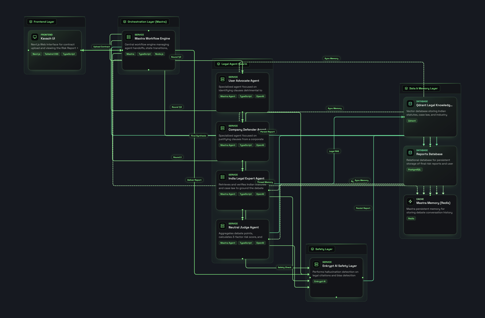

<p align="center">
  
</p>

<h1 align="center">Kavach — AI-Powered Legal Contract Analysis</h1>

<p align="center">
  <strong>A multi-agent adversarial debate system that analyzes contracts from opposing legal perspectives, built for the Indian legal context.</strong>
</p>

<p align="center">
  
  
  
</p>

<p align="center">
  
  
  
  
  
</p>

---

## 📋 Table of Contents

- [Overview](#-overview)
- [Key Features](#-key-features)
- [How Kavach Works](#-how-kavach-works-the-multi-agent-debate-system)
- [Architecture & Tech Stack](#-architecture--tech-stack)
- [Detailed Component Breakdown](#-detailed-component-breakdown)
- [Getting Started](#-getting-started)
- [Demo & Screenshots](#-demo--screenshots)
- [Future Roadmap](#-future-roadmap)
- [Tech Stack Summary](#-tech-stack-summary)
- [Contributing](#-contributing)
- [License](#-license)

---

## 🔍 Overview

**Kavach** (कवच — Hindi for "shield" or "armor") is an AI-powered legal contract analysis platform that uses a **multi-agent adversarial debate system** to analyze contracts from opposing legal perspectives. Instead of relying on a single AI model's opinion, Kavach orchestrates **four specialized AI agents** that argue for and against the contract's clauses, then synthesizes a balanced, evidence-backed verdict.

### The Problem

Millions of individuals in India — job seekers, freelancers, startup founders, and small business owners — sign contracts every day without truly understanding the legal implications. These contracts often contain:

- **Predatory clauses** buried in dense legalese (blanket indemnification, unlimited liability)
- **Overbroad non-compete agreements** that may be unenforceable under Indian law (Section 27, Indian Contract Act, 1872)
- **Data harvesting permissions** that violate the Digital Personal Data Protection Act, 2023 (DPDP)
- **Auto-renewal traps** and hidden termination penalties

Professional legal review costs ₹5,000–₹50,000+ per contract and takes days. **Kavach delivers a multi-perspective legal analysis in under 2 minutes, for free.**

### What Makes Kavach Different

| Traditional AI Contract Review | Kavach Multi-Agent Debate |
|---|---|
| Single model, single perspective | 4 adversarial agents with conflicting mandates |
| Generic global analysis | India-specific legal analysis (ICA 1872, DPDP 2023, IT Act 2000) |
| No verification of AI outputs | Enkrypt AI hallucination & bias scoring on every verdict |
| Static knowledge | Live web, X/Twitter, and Reddit search during debate |
| No knowledge grounding | Qdrant vector DB with 300+ legal risk patterns and Indian case law |

---

## ✨ Key Features

### 🤖 Multi-Agent Adversarial Debate
Four AI agents with conflicting mandates debate the contract across **3 rounds**, producing a balanced analysis that no single model could achieve.

### 🇮🇳 India-First Legal Analysis
A dedicated **India Legal Expert** agent analyzes every clause against the Indian Contract Act (1872), IT Act (2000), and Digital Personal Data Protection Act (2023). It identifies clauses that would be void or unenforceable in Indian jurisdictions.

### 🔴 Real-Time Streaming
The entire debate streams live to the user's browser via **Server-Sent Events (SSE)**. Each agent's argument appears token-by-token in a styled chat interface, so the user watches the legal debate unfold in real time.

### 🧠 Dual-Output Architecture
Each debating agent produces two outputs simultaneously using a custom XML tag format:
- **`<UI_SUMMARY>`** — A punchy, scannable argument shown to the user in the chat UI.
- **`<DEEP_ANALYSIS>`** — A full legal brief with citations sent to the Neutral Judge for the final verdict.

### 📚 Qdrant Legal Knowledge Base
All agents query a curated **Qdrant vector database** containing 300+ entries across three collections (`risk_patterns`, `industry_benchmarks`, `core_legal_sections`) for grounded, evidence-backed arguments.

### 🛡️ Enkrypt AI Safety Layer
Every external tool call (web search, X search, Reddit search) passes through **Enkrypt AI guardrails** for toxicity and injection attack detection. The final verdict is independently scored for **hallucination risk** and **bias**.

### 📊 Quantitative Risk Scoring
The Neutral Judge's verdict is processed through a weighted scoring formula producing a **0–100 Risk Score** across three dimensions:
- **Harm Potential** (40% weight) — Financial and career impact severity
- **Legal Strength** (35% weight) — Enforceability under Indian law
- **Practical Likelihood** (25% weight) — Real-world invocation probability

### 💡 AI-Powered Negotiation Suggestions
After the debate, **Groq AI** (Llama 3.3 70B) generates 3–5 actionable negotiation strategies based on the specific risky clauses identified during the debate, complete with scripts and alternative language.

### 📄 Document Intelligence Pipeline
Contracts are parsed via **LlamaParse** (supports PDF, DOCX) into clean markdown, then structured into a dynamic JSON schema via **GPT-4o-mini** that adapts to the specific document type (NDA, employment agreement, MSA, etc.).

### 🔐 Authentication & User Accounts
Full **Supabase Auth** integration with email/password and **Google OAuth**. Each user's analysis history is persisted and accessible from a personal dashboard.

### 📋 Professional Report Generation
The final report features collapsible sections for the Enkrypt AI security audit and Neutral Judge's full analysis, with an executive summary card and visual risk score display.

---

## ⚙️ How Kavach Works: The Multi-Agent Debate System

Kavach implements a **structured adversarial debate protocol** using four Mastra AI agents. The workflow is fully defined as a Mastra `Workflow` composed of four sequential `createStep` steps:

```
┌─────────────────────────────────────────────────────────────────────────┐
│                        CONTRACT UPLOADED                                │
│                   (PDF / DOCX → LlamaParse → GPT-4o-mini)              │
└─────────────────────┬───────────────────────────────────────────────────┘
                      │
                      ▼
┌─────────────────────────────────────────────────────────────────────────┐
│  ROUND 1 — INITIAL CRITIQUES (Parallel Execution)                      │
│                                                                         │
│  ┌──────────────────────┐     ┌──────────────────────────────────┐     │
│  │   🛡️ User Advocate   │     │  🇮🇳 India Legal Expert           │     │
│  │   (GPT-4o-mini)      │     │   (Qwen2.5-7B via Featherless)  │     │
│  │                      │     │                                  │     │
│  │  • Identifies risks  │     │  • Indian Contract Act analysis  │     │
│  │  • Predatory clauses │     │  • DPDP Act compliance           │     │
│  │  • Hidden fees       │     │  • IT Act 2000 evaluation        │     │
│  │  • Uses Qdrant + Web │     │  • Uses Qdrant + Web search      │     │
│  └──────────────────────┘     └──────────────────────────────────┘     │
└─────────────────────┬───────────────────────────────────────────────────┘
                      │ Both critiques forwarded
                      ▼
┌─────────────────────────────────────────────────────────────────────────┐
│  ROUND 2 — CORPORATE REBUTTAL                                          │
│                                                                         │
│  ┌──────────────────────────────────────────────────────────────────┐  │
│  │   🏢 Company Defender (Qwen2.5-7B via Featherless)              │  │
│  │                                                                  │  │
│  │  • Defends every clause with corporate legal reasoning           │  │
│  │  • Argues liability caps are industry standard                   │  │
│  │  • Cites precedent from Qdrant knowledge base                   │  │
│  │  • Responds to BOTH the User Advocate AND India Legal Expert     │  │
│  └──────────────────────────────────────────────────────────────────┘  │
└─────────────────────┬───────────────────────────────────────────────────┘
                      │ Rebuttal forwarded
                      ▼
┌─────────────────────────────────────────────────────────────────────────┐
│  ROUND 3 — USER ADVOCATE COUNTER-REBUTTAL                              │
│                                                                         │
│  ┌──────────────────────────────────────────────────────────────────┐  │
│  │   🛡️ User Advocate (GPT-4o-mini)                                │  │
│  │                                                                  │  │
│  │  • Counters the Company Defender's arguments                     │  │
│  │  • Strengthens user protection stance                            │  │
│  │  • Provides final recommendations for the user                   │  │
│  └──────────────────────────────────────────────────────────────────┘  │
└─────────────────────┬───────────────────────────────────────────────────┘
                      │ Full 3-round transcript compiled
                      ▼
┌─────────────────────────────────────────────────────────────────────────┐
│  FINAL — NEUTRAL JUDGE VERDICT                                         │
│                                                                         │
│  ┌──────────────────────────────────────────────────────────────────┐  │
│  │   ⚖️ Neutral Judge (GPT-4o)                                     │  │
│  │                                                                  │  │
│  │  • Receives FULL transcript from all 3 rounds                    │  │
│  │  • Weighs corporate needs vs. user rights vs. Indian law         │  │
│  │  • Queries Qdrant for industry benchmarks                        │  │
│  │  • Issues final balanced verdict                                 │  │
│  │  • Verdict scored → 0-100 Risk Score + Enkrypt AI audit          │  │
│  └──────────────────────────────────────────────────────────────────┘  │
└─────────────────────────────────────────────────────────────────────────┘
```

### Why Adversarial Debate?

A single LLM prompt asking "is this contract risky?" produces shallow, one-sided analysis. By forcing agents with **conflicting mandates** to argue against each other — and then having a Neutral Judge synthesize the debate — Kavach produces analysis that is:

1. **More thorough** — The Company Defender forces the User Advocate to strengthen weak arguments.
2. **More balanced** — The Judge weighs both sides rather than defaulting to alarm.
3. **More trustworthy** — Arguments are grounded in Qdrant legal knowledge and live web search results, not hallucinated.

---

## 🏗 Architecture & Tech Stack

<p align="center">
  
</p>

### 🔗 Mastra — Multi-Agent Orchestration Engine

**[Mastra](https://mastra.ai)** (`@mastra/core` v1.46.0) is the backbone of Kavach's intelligence layer. We use it for:

| Mastra Feature | How Kavach Uses It |
|---|---|
| **`Agent`** class | Defines all 4 debate agents with distinct `instructions`, `model`, `tools`, and `memory` |
| **`Workflow`** class | Defines the `ContractDebate` workflow as a directed graph of steps (`InitialCritiques → CompanyDefenderRebuttal → UserAdvocateRebuttal → NeutralJudgeVerdict`) |
| **`createStep`** | Each debate round is a discrete step with typed I/O. Steps pass data via `getStepResult()` |
| **`createTool`** | All agent tools (Qdrant search, web search, X search, Reddit search) are defined as Mastra tools with Zod-validated input schemas |
| **`Memory` + `UpstashStore`** | `@mastra/memory` with `@mastra/upstash` provides persistent conversation memory across agent interactions within a thread |
| **`agent.stream()`** | All debate responses are streamed token-by-token via Mastra's streaming API, piped to the frontend via SSE |
| **`Mastra` class** | Top-level orchestrator registering all agents and workflows for the framework runtime |

**Key architectural choice:** We use Mastra's `Workflow.createRun()` API to create unique debate sessions per document, enabling concurrent analyses without state collision.

### 🔎 Qdrant — Legal Knowledge Vector Database

**[Qdrant](https://qdrant.tech)** (`@qdrant/js-client-rest` v1.18.0) serves as Kavach's **legal knowledge base**, providing grounded context for every agent argument.

| Collection | Contents | Purpose |
|---|---|---|
| `risk_patterns` | 100+ contract risk patterns with severity scores | Agents identify and classify risky clauses by matching against known patterns |
| `industry_benchmarks` | 100+ industry-standard contract norms (SaaS, employment, NDA, etc.) | Judge compares contract terms against what is "normal" in the industry |
| `core_legal_sections` | 100+ Indian statutory provisions (ICA 1872, DPDP 2023, IT Act 2000) | India Legal Expert grounds analysis in actual statutory text |

**Embedding pipeline:**
1. Legal text is embedded using **Google Gemini Embedding-2** (3072 dimensions)
2. Stored in Qdrant Cloud with **Cosine similarity** distance metric
3. Score threshold of **0.60** filters low-relevance results
4. Seeded via custom scripts (`scripts/seed-qdrant.ts`) with curated Indian legal knowledge

**How agents use Qdrant:** Every agent has access to the `qdrantSearchTool`, a Mastra `createTool` that accepts a natural language legal query, generates an embedding via Gemini, and returns the top-k most semantically similar legal precedents, risk patterns, or benchmarks.

### 🛡️ Enkrypt AI — Safety Guardrails & Hallucination Scoring

**[Enkrypt AI](https://enkryptai.com)** provides two critical safety functions:

#### 1. Tool Call Guardrails (Pre-Execution)
Before any **external-facing tool** executes (web search, X search, Reddit search), the query is sent to Enkrypt AI's `/guardrails/detect` endpoint for:
- **Toxicity detection** — Blocks queries containing hate speech, harassment, or harmful content
- **Injection attack detection** — Blocks prompt injection attempts with a >0.7 confidence threshold

This prevents adversarial users from weaponizing the agents' tool access. Internal tools (like Qdrant search) bypass this check for performance.

**Resilience design:** The Enkrypt check uses a strict **2500ms timeout** with a single attempt and a **5-minute in-memory cache** to prevent repeated API calls for identical queries. If Enkrypt is unreachable, the system **fails open** (allows the tool call) and logs a warning — ensuring the debate workflow never hangs.

#### 2. Verdict Hallucination & Bias Audit (Post-Debate)
After the Neutral Judge issues its verdict, the entire text is sent to Enkrypt AI for:
- **Toxicity scoring** — Checks for HATE, HARASSMENT, ILLICIT_BEHAVIOR, SELF_HARM, VIOLENCE_THREATS
- **Bias detection** — Flags systematic bias in the verdict

The maximum risk probability across all detectors is extracted and rendered as a **Hallucination Risk %** in the final report, giving users a quantified confidence metric.

---

## 🧩 Detailed Component Breakdown

### Backend (`backend/`)

| Component | File(s) | Description |
|---|---|---|
| **Fastify Server** | `src/server.ts` | HTTP server (Fastify 5) with CORS, multipart uploads (10MB limit), health check, SSE streaming, and REST API routes |
| **Document Processor** | `src/services/documentProcessor.ts` | Full pipeline: LlamaParse (PDF/DOCX → Markdown), GPT-4o-mini (Markdown → Structured JSON), legal document validation, Redis storage, Supabase persistence |
| **Mastra Instance** | `src/mastra/index.ts` | Central `Mastra` class registering all agents and the debate workflow |
| **Debate Workflow** | `src/mastra/workflow/index.ts` | 4-step Mastra `Workflow` with streaming, dual-output parsing (`<UI_SUMMARY>` / `<DEEP_ANALYSIS>`), and SSE event emission |
| **User Advocate** | `src/mastra/agents/userAdvocate.ts` | GPT-4o-mini agent identifying predatory clauses, hidden fees, and data privacy violations |
| **Company Defender** | `src/mastra/agents/companyDefender.ts` | Qwen2.5-7B (via Featherless AI) agent defending corporate interests and standard business practices |
| **India Legal Expert** | `src/mastra/agents/indiaLegalExpert.ts` | Qwen2.5-7B (via Featherless AI) agent analyzing under ICA 1872, DPDP 2023, IT Act 2000 |
| **Neutral Judge** | `src/mastra/agents/neutralJudge.ts` | GPT-4o agent synthesizing all 3 rounds into a balanced verdict |
| **Qdrant Search Tool** | `src/mastra/tools/qdrantSearchTool.ts` | Mastra tool: embeds query via Gemini → searches Qdrant → returns legal patterns |
| **Web Search Tool** | `src/mastra/tools/webSearchTool.ts` | Mastra tool: Enkrypt-guarded Tavily web search for legal precedents |
| **X Search Tool** | `src/mastra/tools/xSearchTool.ts` | Mastra tool: Enkrypt-guarded Tavily search scoped to X/Twitter for company reputation and complaints |
| **Reddit Search Tool** | `src/mastra/tools/redditSearchTool.ts` | Mastra tool: Enkrypt-guarded Tavily search scoped to Reddit for real-world contract experiences |
| **Enkrypt Service** | `src/services/enkryptService.ts` | Centralized Enkrypt AI client with caching, timeouts, retry logic, tool call guardrails, and hallucination scoring |
| **Agent Memory** | `src/mastra/memory.ts` | `@mastra/memory` with `@mastra/upstash` UpstashStore for persistent conversation context |
| **Redis Client** | `src/lib/redis.ts` | Singleton Upstash Redis client (HTTP-based) for session state and document storage with 24h TTL |
| **Qdrant Client** | `src/lib/qdrant.ts` | Singleton Qdrant Cloud client with collection names and vector configuration constants |
| **Supabase Client** | `src/lib/supabase.ts` | Dual-client setup: admin client (bypasses RLS) for server writes + user-scoped client (respects RLS) for authenticated reads |
| **Auth Middleware** | `src/lib/auth.ts` | Fastify preHandler hook: extracts Bearer tokens, verifies JWTs against Supabase Auth, supports required and optional authentication |
| **Risk Scoring** | `src/services/documentProcessor.ts` | Weighted scoring formula: `(Harm × 0.4) + (Legal × 0.35) + (Likelihood × 0.25)` producing 0–100 score with rubric-based GPT-4o-mini evaluation |
| **Negotiation Gen** | `src/services/documentProcessor.ts` | Groq-powered (Llama 3.3 70B) structured generation using Vercel AI SDK `generateObject` with Zod schema enforcement |

### Frontend (`frontend/`)

| Component | File(s) | Description |
|---|---|---|
| **Framework** | Next.js 16 with App Router | React 19, TypeScript, Tailwind CSS 4, Framer Motion |
| **Landing / Auth** | `src/app/login/page.tsx`, `src/app/register/page.tsx` | Email/password + Google OAuth login via Supabase Auth |
| **Dashboard** | `src/app/dashboard/page.tsx` | Document upload (drag-and-drop + file picker), analysis history, user type selection, rotating legal quotes |
| **Analysis Page** | `src/app/analysis/page.tsx` | Multi-tab interface: Clauses View, Debate Room (live SSE chat), Negotiation Suggestions, Final Report |
| **Debate Room** | Embedded in analysis page | Real-time chat UI with agent avatars, styled message bubbles, typing indicators, and ReactMarkdown rendering |
| **Final Report** | Embedded in analysis page | Hero risk score, executive summary, collapsible Enkrypt AI security audit, collapsible Neutral Judge verdict (with Framer Motion animations) |
| **Negotiation Room** | Embedded in analysis page | Dynamic suggestion cards with risk warnings and recommendation scripts, loading states |
| **Auth Middleware** | `src/lib/supabase/` | Supabase SSR client for server-side auth in App Router |
| **Server Actions** | `src/app/actions/auth.ts` | Next.js Server Actions for sign-in, sign-up, sign-out, and Google OAuth |

### Knowledge Base & Scripts

| Component | File(s) | Description |
|---|---|---|
| **Qdrant Seeder** | `scripts/seed-qdrant.ts` | Seeds all 3 Qdrant collections with curated Indian legal knowledge |
| **Data Generator** | `scripts/generate-qdrant-data.ts` | Generates synthetic legal risk patterns and benchmarks |
| **Data Expansion** | `scripts/expand-data.ts` | Expands the knowledge base with additional entries |
| **Qdrant Inspector** | `scripts/inspect-qdrant.ts` | CLI tool to inspect and verify Qdrant collection contents |
| **DB Schema** | `supabase/schema.sql` | Full Supabase schema with profiles, analyses, debate_messages, clause_annotations tables + RLS policies |

---

## 🚀 Getting Started

### Prerequisites

- **Node.js** ≥ 22.0.0
- **npm** (comes with Node.js)
- Active accounts for: [Supabase](https://supabase.com), [Qdrant Cloud](https://qdrant.tech), [Upstash Redis](https://upstash.com)

### 1. Clone the Repository

```bash
git clone https://github.com/nivas25/Kavach.git
cd Kavach
```

### 2. Setup Backend

```bash
cd backend
npm install
```

Create `backend/.env` from the example:

```bash
cp .env.example .env
```

Fill in your API keys:

```env
# ═══ Server ═══
PORT=8080

# ═══ LLM API Keys ═══
OPENAI_API_KEY="sk-..."                    # Used by User Advocate + Neutral Judge
FEATHERLESS_API_KEY_1="..."                # Company Defender (Qwen2.5-7B)
FEATHERLESS_API_KEY_2="..."                # India Legal Expert (Qwen2.5-7B)

# ═══ Document Parsing ═══
LLAMAPARSE_API_KEY="llx-..."               # LlamaParse for PDF/DOCX parsing

# ═══ Search ═══
TAVILY_API_KEY="tvly-..."                  # Web, X, and Reddit search

# ═══ Safety ═══
ENKRYPT_API_KEY="..."                      # Enkrypt AI guardrails + hallucination scoring

# ═══ Vector DB ═══
QDRANT_URL="https://xxx.qdrant.io:6333"    # Qdrant Cloud cluster
QDRANT_API_KEY="..."                       # Qdrant API key

# ═══ State & Memory ═══
UPSTASH_REDIS_REST_URL="https://..."       # Upstash Redis for session state + Mastra memory
UPSTASH_REDIS_REST_TOKEN="..."             # Upstash Redis token

# ═══ Database & Auth ═══
SUPABASE_URL="https://xxx.supabase.co"     # Supabase project URL
SUPABASE_ANON_KEY="eyJ..."                 # Supabase public anon key
SUPABASE_SERVICE_ROLE_KEY="eyJ..."         # Supabase service role (server-side only)

# ═══ Embeddings ═══
GEMINI_API_KEY_4="..."                     # Google Gemini Embedding-2 for Qdrant vectors

# ═══ Negotiation ═══
GROQ_API_KEY="gsk_..."                     # Groq API for negotiation suggestions (Llama 3.3 70B)
```

Seed the Qdrant knowledge base:

```bash
npx ts-node scripts/seed-qdrant.ts
```

Start the backend:

```bash
npm run dev
```

The API server starts at `http://localhost:8080`.

### 3. Setup Frontend

```bash
cd ../frontend
npm install
```

Create `frontend/.env.local`:

```env
NEXT_PUBLIC_API_URL="http://127.0.0.1:8080"
NEXT_PUBLIC_SUPABASE_URL="https://xxx.supabase.co"
NEXT_PUBLIC_SUPABASE_ANON_KEY="eyJ..."
```

Start the frontend:

```bash
npm run dev
```

The app opens at `http://localhost:3000`.

### 4. Setup Supabase Database

1. Go to your Supabase project → SQL Editor
2. Paste the contents of `supabase/schema.sql` and execute
3. Enable **Google OAuth** in Supabase Auth settings (optional)

---

## 📸 Demo & Screenshots

> Screenshots and demo video coming soon. The application features:

| Screen | Description |
|---|---|
| **Login** | Clean auth page with email/password + Google OAuth |
| **Dashboard** | Drag-and-drop document upload, user type selector, analysis history |
| **Debate Room** | Live streaming chat with agent avatars and typing indicators |
| **Final Report** | Risk score hero card, collapsible Enkrypt audit, collapsible Judge verdict |
| **Negotiation** | AI-generated suggestion cards with risk warnings and scripts |

---

## 🗺 Future Roadmap

- [ ] **Export to PDF** — Generate downloadable professional reports
- [ ] **Clause-Level Annotations** — Clickable clause cards linking to specific debate segments
- [ ] **Multi-Language Support** — Hindi, Tamil, Telugu, Kannada contract analysis
- [ ] **Contract Comparison** — Diff two contract versions side-by-side
- [ ] **Redline Generation** — AI-powered tracked changes for negotiated clauses
- [ ] **Custom Agent Personas** — Let users define their own risk tolerance and priorities
- [ ] **Batch Analysis** — Upload multiple contracts for portfolio-level risk assessment
- [ ] **Webhook Notifications** — Alert users when long-running analyses complete
- [ ] **Fine-tuned Models** — Domain-specific models trained on Indian contract corpus

---

## 📊 Tech Stack Summary

| Layer | Technology | Purpose |
|---|---|---|
| **Agent Orchestration** | Mastra (`@mastra/core` v1.46.0) | Multi-agent workflow, tool system, streaming, memory |
| **Vector Database** | Qdrant Cloud (`@qdrant/js-client-rest`) | Legal knowledge retrieval (risk patterns, benchmarks, statutes) |
| **AI Safety** | Enkrypt AI | Tool call guardrails (toxicity, injection) + verdict hallucination scoring |
| **LLM — Advocate & Judge** | OpenAI GPT-4o / GPT-4o-mini | High-quality reasoning for user protection and final verdicts |
| **LLM — Defender & Expert** | Qwen2.5-7B via Featherless AI | Fast, cost-effective agentic models for adversarial roles |
| **LLM — Negotiation** | Llama 3.3 70B via Groq | Ultra-fast structured generation for negotiation suggestions |
| **LLM — Extraction** | GPT-4o-mini (OpenAI) | Structured JSON extraction from contract markdown |
| **Embeddings** | Google Gemini Embedding-2 | 3072-dimensional vectors for semantic legal search |
| **Document Parsing** | LlamaParse (LlamaIndex Cloud) | PDF and DOCX to clean markdown conversion |
| **Web Search** | Tavily API | Real-time legal precedent, X/Twitter, and Reddit search |
| **Frontend** | Next.js 16, React 19, TypeScript | App Router, Server Actions, SSR |
| **Styling** | Tailwind CSS 4, Framer Motion | Responsive design with smooth animations |
| **UI Components** | shadcn/ui, Lucide React | Component library and icon system |
| **Markdown Rendering** | react-markdown | Agent response rendering in chat bubbles |
| **Backend Server** | Fastify 5 | High-performance HTTP server with SSE streaming |
| **Schema Validation** | Zod 4 | Type-safe schemas for tool inputs, API responses, and AI outputs |
| **Session State** | Upstash Redis (HTTP) | Serverless Redis for document state (24h TTL) |
| **Agent Memory** | `@mastra/memory` + `@mastra/upstash` | Persistent conversation context across debate rounds |
| **Database** | Supabase (PostgreSQL) | User profiles, analysis history, RLS-protected queries |
| **Authentication** | Supabase Auth | Email/password + Google OAuth, JWT verification |
| **Deployment — Backend** | Railway (Nixpacks) | Auto-build and deploy from Git |
| **Deployment — Frontend** | Vercel | Next.js-optimized hosting |
| **Type System** | TypeScript 5 | End-to-end type safety |

---

## 🤝 Contributing

Contributions are welcome! To get started:

1. Fork the repository
2. Create a feature branch (`git checkout -b feature/amazing-feature`)
3. Commit your changes (`git commit -m 'Add amazing feature'`)
4. Push to the branch (`git push origin feature/amazing-feature`)
5. Open a Pull Request

Please ensure your code follows the existing patterns and includes appropriate TypeScript types.

---

## 📄 License

This project is licensed under the **MIT License** — see the [LICENSE](LICENSE) file for details.

---

<p align="center">
  <strong>Built with ❤️ for the Indian legal ecosystem</strong><br/>
  <em>Kavach — Because everyone deserves to understand what they're signing.</em>
</p>
